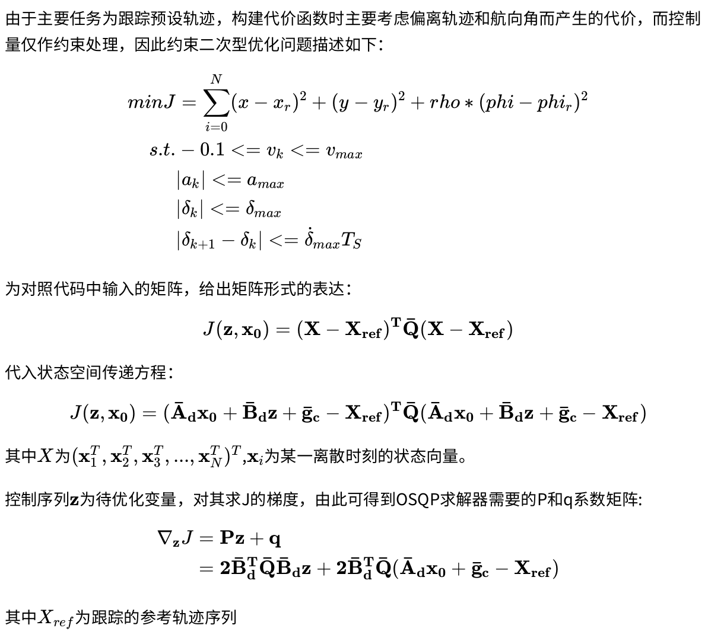

# Motion_Planning_Hw6

深蓝学院《移动机器人运动规划》第九期，第6章课程作业。该代码实现了基于nonlinear MPC的轨迹跟踪控制，并解决了系统控制时延的问题。

## HOW TO RUN
```
./install_tools.sh
catkin_make -j1
source devel/setup.bash
roslaunch mpc_car simulation.launch
```
## HOW TO TURN PARAMETERS
```
./src/mpc_car/config/mpc_car.yaml -> mpc parameters
./src/car_simulator/config/car_simulator.yaml -> initial states (in simulation)
```

## Theory

### Linearize  Nonlinear Model

将非线性模型泰勒展开后，整理成状态传递方程的形式如下：
$$
\begin{aligned}
\mathbf{\dot x} & =\mathbf{A_cx +B_cu+g_c}\\
\frac{ \mathbf {x_{k+1}-x_{k}}}{T_s}&=\mathbf{A_cx_k+B_cu_k+g_c}\\
\mathbf{x_{k+1}}&=(\mathbf I+ T_s\mathbf A_c)\mathbf {x_k}+T_s\mathbf{B_cu_k}+T_s\mathbf{g_c}\\
\mathbf{x_{k+1}}&=\mathbf{A_kx_k+B_ku_k+g_k}
\end{aligned}
$$选取经典的自行车非线性控制模型，因此矩阵内部各项具体表达如下：



### Constrained Quadratic Problem
 
由于主要任务为跟踪预设轨迹，构建代价函数时主要考虑偏离轨迹和航向角而产生的代价，而控制量仅作约束处理，因此约束二次型优化问题描述如下：
 $$
 \begin{aligned}
 min  J &= \sum_{i=0}^N(x-x_r)^2+ (y-y_r)^2 + rho * (phi-phi_r)^2 \\
    s.t. &-0.1 <= v_k <= v_{max}\\
    & |a_k| <= a_{max}\\
    & |\delta_k| <= \delta_{max}\\
    & |\delta_{k+1} - \delta_k| <= \dot\delta_{max}T_S\\
\end{aligned}
$$为对照代码中输入的矩阵，给出矩阵形式的表达：
$$
  J\mathbf   {(z, \mathbf x_0)  =( X-X_{ref})^T\bar Q( X-X_{ref})}
$$代入状态空间传递方程：

$$
   J\mathbf {( z, x_0) 
     =(\bar A_d  x_0 +\bar B_d  z +\bar g_c -X_{ref})^T\bar Q(\bar A_d  x_0 +\bar B_d   z +\bar g_c -X_{ref})}
$$其中$X$为$(\mathbf x_1^T,\mathbf x_2^T,\mathbf x_3^T,...,\mathbf x_N^T)^T$,$\mathbf x_i$为某一离散时刻的状态向量。


控制序列$\mathbf z$为待优化变量，对其求J的梯度，由此可得到OSQP求解器需要的P和q系数矩阵:
$$
\begin{aligned}
    \nabla _{\mathbf z} J &= \mathbf{P z +q}\\
    &=\mathbf{2\bar B_d^T\bar Q \bar B_d  z +2\bar B_d^T\bar Q(\bar A_d  x_0  +\bar g_c -X_{ref})}
\end{aligned}
$$其中$X_{ref}$为跟踪的参考轨迹序列

### Delay Compensation
对于带有控制时延的系统，需联合上一次优化得到的控制序列，将观测状态(t时刻观察到的)补偿至未来的$t+\tau $时刻的状态量，才能作为MPC求解过程的初始状态$\mathbf{\bar x_0}$。
$$
\mathbf{\bar x_0} = \mathbf{x}(t+\tau)
$$主要基于非线性方程      $
 \mathbf{ \dot x} =\mathbf A(t) \mathbf x(t)+\mathbf B(t) \mathbf u(t-\tau)
$，采用四阶龙格库塔法求得$\mathbf x(t+\tau)$


## AN EXAMPLE
<p align="center">
    
</p>
