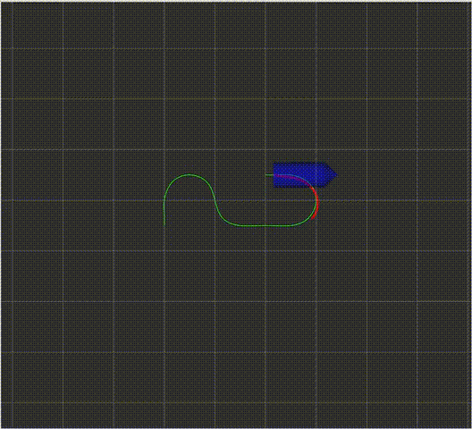

# Motion_Planning_Hw6

深蓝学院《移动机器人运动规划》第九期，第6章课程作业。该代码实现了基于nonlinear MPC的轨迹跟踪控制，并解决了系统控制时延的问题。

## HOW TO RUN

```
./install_tools.sh
catkin_make -j1
source devel/setup.bash
roslaunch mpc_car simulation.launch
```

## HOW TO TURN PARAMETERS

```
./src/mpc_car/config/mpc_car.yaml -> mpc parameters
./src/car_simulator/config/car_simulator.yaml -> initial states (in simulation)
```

## Theory

### Linearize  Nonlinear Model

<p align="center">
  
</p>

### Constrained Quadratic Problem
 
<p align="center">
   
</p>

### Delay Compensation

<p align="center">
  
 </p>

## RESULT
- 第一条轨迹结果（考虑输入延迟生效）如下：
<p align="center">
    
</p>
- 第二条轨迹结果：
<p align="center">
    
</p>
- 对于第三条轨迹，由于动力学ddelta_max的限制，模型车在进入第二个转弯的时候拐不过来，因此运行失败，如下所示：
<p align="center">
    
</p>
将ddelta_max改为原来的两倍，最终能顺利到达终点。
<p align="center">
    
</p>
